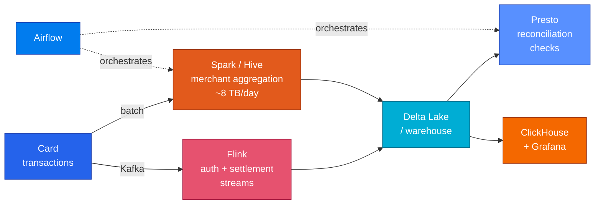

<h1 align="center">Swapna Tondapu</h1>

  <b>Data Engineer @ American Express</b> · Santa Clara, CA 
  I keep the pipelines behind <b>~1M card transactions and ~8 TB a day</b> honest.

  
  
  
  

---

### A bit about me

I fell into data engineering through the unglamorous door: someone asked why a number in a report had changed overnight, and I went looking. A settlement had landed four days late and quietly rewritten a day everyone thought was finished.

That's still the part of the job I like most. Not the dashboards — the promise underneath them. That the number is the same the second time you ask. That late data corrects itself instead of silently vanishing. That when two systems disagree, something tells you before the finance team does.

Day to day at **American Express** that means Spark and Hive over card transactions, Kafka and Flink for authorization and settlement events, Airflow holding it together, and ClickHouse with Grafana at the front so people can actually see it.

 

<table>
<tr><td width="50%" valign="top">

**Education**

`MS Business Analytics` — Texas A&M University
GPA 4.0 · Aug 2022 – Dec 2023

**Certification**

`AWS Certified Data Engineer – Associate`

</td><td width="50%" valign="top">

**Experience**

`Data Engineer` — **American Express**, Palo Alto
Jan 2024 – present

`Data Platform` — **Johnson & Johnson** Consumer Health
Prior: **JioSaavn**

</td></tr>
</table>

---

### What I actually work on

A few things I'm proud of rather than just familiar with:

- Cut a daily merchant aggregation's runtime by **~25%** — the culprit was skewed joins, fixed by repartitioning and tuning the Spark SQL
- Built the **Presto reconciliation checks** that catch schema drift before it reaches anyone downstream
- Maintain an **SCD2 merchant dimension** and incremental loads that handle late-arriving settlements without rewriting history

---

### Tools I reach for

---

### Projects

<table>
<tr><td width="100%">

#### [merchant-settlement-dbt](https://github.com/swapnatondapu7-netizen/merchant-settlement-dbt)

**The four-days-late settlement problem, modelled properly.**

Authorizations and settlements arrive as two streams that refuse to line up — settlements land days late, amounts drift with tips and partial captures, and some authorizations never settle at all. Each one breaks a naive pipeline quietly, which is the dangerous kind.

So I built it the way it should be built: an incremental model that reprocesses a trailing window instead of only today, an SCD2 snapshot so re-tiering a merchant doesn't rewrite last quarter, and tests that fail for the right reasons.

> I proved the late-arrival logic rather than claiming it — injected a settlement arriving 4 days late and watched an already-written day correct itself from **4 open auths / $173.78** to **3 / $187.87**.

</td></tr>
</table>

---

### What I'm working on now

<table>
<tr><td width="33%" valign="top" align="center">

**Closing the dbt gap**

Expressing the transformation, DAG and testing work I do by hand in dbt — models, snapshots and tests rather than three separate systems.

</td><td width="33%" valign="top" align="center">

**Streaming reconciliation**

Taking the auth-vs-settlement problem upstream: event-time windows, watermarks, and what to do with the event that arrives late.

</td><td width="33%" valign="top" align="center">

**Data contracts**

Tests that fail for the right reasons. A check that fires on correct data teaches people to ignore checks.

</td></tr>
</table>

---

  <b>Open to mid-level Data Engineer / Analytics Engineer roles across the US.</b> 
  Currently in Santa Clara, happy to relocate · <a href="mailto:swapnatondapu7@gmail.com">swapnatondapu7@gmail.com</a>

