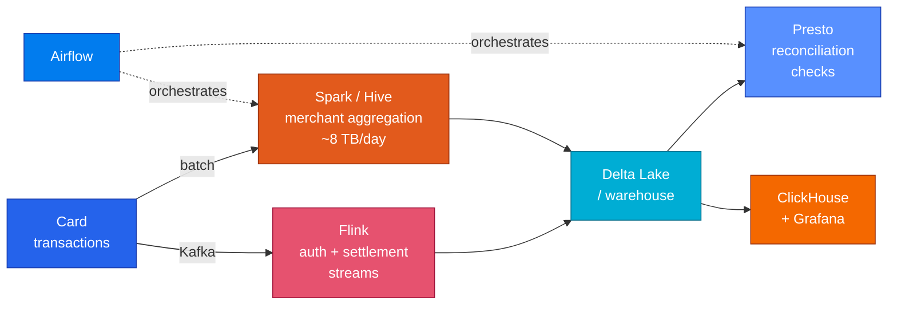

<h1 align="center">Swapna Tondapu</h1>

  <b>Data Engineer @ American Express</b> · Santa Clara, CA 
  I work on the data pipelines behind about <b>1M card transactions a day</b>.

  
  
  
  

---

### A bit about me

I got into data engineering because almost everything in tech now runs on data. Whether a product works, what a company builds next, how a bank spots a problem, all of it comes back to whether the data is there and whether you can trust it. I liked the idea of working on that part.

What I enjoy most is building pipelines people can rely on. Getting the same answer when you run something twice. Making sure late data still gets counted. Catching a problem in the pipeline before it turns into a wrong number in someone's report.

At American Express I work on the data behind card transactions, around 1M a day. I use Spark and Hive for the batch jobs, Kafka and Flink for the authorization and settlement events, Airflow to schedule everything, and ClickHouse with Grafana so people can see the numbers.

 

<table>
<tr><td width="50%" valign="top">

**Education**

`MS Business Analytics` — Texas A&M University
GPA 4.0 · Aug 2022 – Dec 2023

**Certification**

`AWS Certified Data Engineer – Associate`

</td><td width="50%" valign="top">

**Experience**

`Data Engineer` — **American Express**, Palo Alto
Jan 2024 – present

`Data Platform` — **Johnson & Johnson** Consumer Health
Prior: **JioSaavn**

</td></tr>
</table>

---

### What I actually work on

Some things I have actually done, not just used:

- Made a daily merchant job about **25% faster**. The problem was skewed joins, so I repartitioned the data and tuned the Spark SQL.
- Wrote the **Presto checks** that catch a schema change before it reaches the teams using the data.
- Look after an **SCD2 merchant table** and the incremental loads, so late settlements get counted without rewriting old history.

---

### Tools I reach for

---

### Projects

<table>
<tr><td width="100%">

#### [merchant-settlement-dbt](https://github.com/swapnatondapu7-netizen/merchant-settlement-dbt)

**The late settlement problem, built in dbt.**

Authorizations and settlements come in as two separate streams that do not match up. Settlements can be days late, the amount can change because of tips, and some authorizations never settle at all. None of these throw an error. They just make the number wrong.

So the model goes back over the last few days each run instead of only today, keeps merchant history with a snapshot so changing a merchant does not change last quarter's numbers, and has tests that only fail when something is really wrong.

> I checked that this actually works instead of assuming it. I added a settlement that arrived 4 days late, ran the model again, and the old day corrected itself from **4 unsettled / $173.78** to **3 / $187.87**.

</td></tr>
<tr><td width="100%">

#### [streaming-recon](https://github.com/swapnatondapu7-netizen/streaming-recon)

**The same problem, but on the stream side.**

Two Kafka streams that do not line up, matched in Flink SQL on event time. An interval join so the job does not have to remember both sides forever, and LEFT joins so the transactions that never match get reported instead of quietly disappearing.

> It found all 5 authorizations that never settled and all 3 settlements with no authorization, and still matched a settlement that arrived **6 days late**. `./run.sh` goes from an empty Docker to 7/7 checks in about two minutes.

</td></tr>
<tr><td width="100%">

#### [schema-matcher](https://github.com/swapnatondapu7-netizen/schema-matcher)

**Using a model for the boring half of onboarding a feed.**

Every partner sends the same facts under different column names, and somebody maps them by hand. This does the first pass with embeddings, comparing what is *in* a column as well as what it is called, so a column named `COL_7` still gets recognised from its values.

> The important part is that it is allowed to say it does not know. A wrong mapping is silent and turns up in a report later, so the threshold is chosen with an explicit 10:1 cost of a wrong answer against a human review.

</td></tr>
<tr><td width="100%">

#### [pipeline-anomaly](https://github.com/swapnatondapu7-netizen/pipeline-anomaly)

**Catching the job that succeeds and loads half the data.**

A crash is easy, someone gets paged. The expensive one reports success after loading 40% of the rows. Volume moves with the hour, the weekday and month end, so a fixed threshold either fires every night or catches nothing.

> Scored the way you would actually judge it: what got caught, how long it took, and how many false alarms a week. Waiting three hours before alerting took false alarms from 20 a week to 3. An Isolation Forest found no more than the medians did, at 91 a week, and the README says so.

</td></tr>
</table>

---

### What I'm working on now

<table>
<tr><td width="33%" valign="top" align="center">

**Closing the dbt gap**

Doing the transformations, dependencies and tests I already do by hand, but in dbt, where they live in one place.

</td><td width="33%" valign="top" align="center">

**Backfills that do not hurt**

Reprocessing a month of history without taking the pipeline down or double counting anything. Mostly a question of making jobs safe to run twice.

</td><td width="33%" valign="top" align="center">

**Data contracts**

Writing tests that only fail when data is really wrong. If a test keeps failing on good data, people stop reading it.

</td></tr>
</table>

---

  <b>Open to mid-level Data Engineer / Analytics Engineer roles across the US.</b> 
  Currently in Santa Clara, happy to relocate · <a href="mailto:swapnatondapu7@gmail.com">swapnatondapu7@gmail.com</a>

